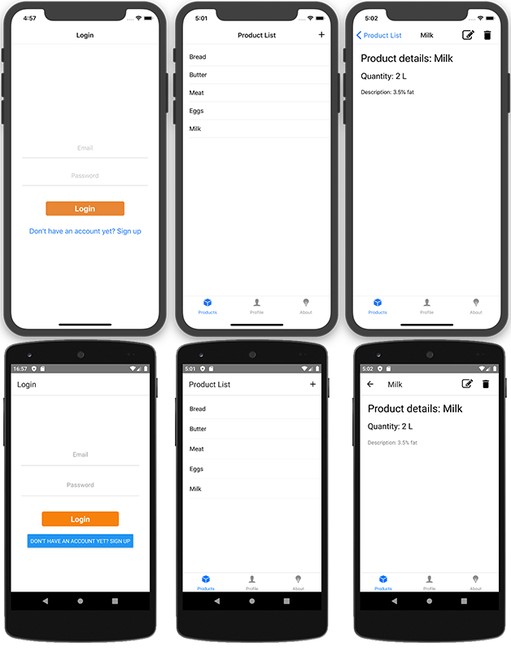

# Product Manager Demo

This repository is a demo app based on my **[article on Expo + React Native Firebase integration](https://bartlomiej-klocek.medium.com/how-to-integrate-react-native-firebase-into-expo-d34712eaf64d)** - it uses Expo Development Client and Config Plugins to integrate native Firebase into Expo app. Read the article for more details.

Yet another React Native CRUD app, written in
TypeScript for demo purposes. Features:

- View product list
- View product details
- Add, edit and delete products
- Language/i18n support
- Google (Firebase) Analytics integration
- User accounts (Firebase auth). Sign in and Sign up support.
- Display to users their own products.

See also [Technical Features](#technical-features)

Written to show:

- Expo Dev Client and config plugins
- Integration with React Native Firebase
- Learn how to CRUD in React Native



# Readme below is outdated. It is to be updated soon


## Requirements

- Expo CLI 5.x or newer
- Created Firebase project with Firestore database
  _(unless you use built-in fake API)_
- (Recommended) Yarn

## Installation

1. Clone Repo
2. `yarn install`
3. Mac/iOS only: `cd ios && pod install && cd ..`
4. To use Firestore database, download Google Services config files
   - Put `google-services.json` in the root directory
     See docs [here](https://invertase.io/oss/react-native-firebase/quick-start/android-firebase-credentials)
     for Android
   - Put `GoogleService-Info.plist` in the root directory.
     See docs [here](https://invertase.io/oss/react-native-firebase/quick-start/ios-firebase-credentials)
     for iOS

## Running

`package.json` contains a few run scripts:

- `start` - Runs just Metro bundler
- `android` - Builds Android project and runs it (Requires Android SDK)
- `ios` - Builds iOS project and runs it (Requires Xcode)
- `expo` - Runs expo daemon - possible to open app in Expo Client

#### Switching API

By default, an in-memory Fake API is selected. To enable Firestore,
open `src/api/index.ts` and then

```typescript
const Api = new FakeApi();
//const Api = new FirestoreProductsApi();
```

comment out the first line, and uncomment the second one.

## Used libraries and frameworks

- React Native
- Expo - uses bare workflow
- React Navigation
- Native-base - for UI components
- Redux
- Redux Saga
- Firestore database
- React Native Firebase (Firestore, Analytics) - for native builds
- Firebase JS SDK - for Expo client
- i18n-js for language support

## Technical features

- Two implementations of data management API: Firebase Firestore
  and simple in-memory dictionary based API for demo purposes. Interfaces
  needed to create custom implementation are provided.
- Support for event-driven APIs (for example Firestore `onSnapshot()`)
- Expo Client doesn't support native modules, React-Native-Firebase
  cannot be used there. [See details](https://docs.expo.io/versions/v36.0.0/guides/using-firebase/).
  App provides auto fallback Firebase JS SDK and loads it instead of RNFirebase
  when using Expo Client.
  > Note: React-Native-Firebase and Firestore JS SDK provide identical API,
  > so there's no need to split database implementation.

> Only Firestore module is supported on Expo, because it's necessary
> for app to work.
> Analytics and other Firebase modules are working only on native builds

## File structure

- `index.js` - React Native main file
- `App.tsx` - Expo main file. Redirects to `src/app.tsx`
- `firebase_credentials.json` - For Expo users - credentials
  to Firebase JS SDK
- `src` - App source code
- `src/App.tsx` - Main App component
- `src/api` - Product API interfaces and implementations
  - `Firestore` - Firestore API implementation
    - `firestoreProvider.ts` - provide basic RNFB configuration
  - `Fake` - FakeApi - simple dictionary based in-memory API impl.
- `src/components` - React components
- `src/core` - Redux implementation files
  - `actions` - Redux Action definitions
  - `constants` - names and type names for actions
  - `reducers`
  - `sagas` - Side effects for actions.
    - `products.saga.ts` - Connects Redux actions and store with API
- `src/hooks` - custom React hooks
- `src/i18n` - Internalization / language support files
- `src/navigation` - React-navigation route and screen configuration
- `src/screens` - Navigation Screen component definitions
- `src/utils` - Common utility code
- `__tests__` - Unit tests for project

## TODO / Not yet implemented

- ~~Information message boxes is spamming too much about state~~
  but I think it's OK for demo purposes
- Unit tests
  > As there are only few tests, some features might not work as expected!
